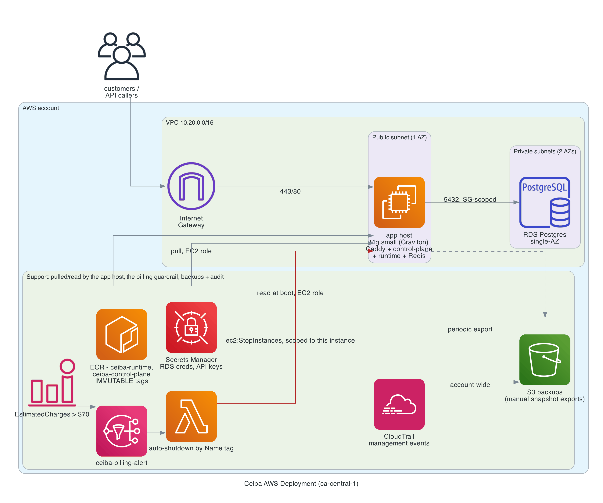

# ceiba-infra

Infrastructure and deployment for [Ceiba App](https://app.useceiba.com), [Ceiba Docs](https://docs.useceiba.com), and [Ceiba](https://useceiba.com). This repo owns how Ceiba runs in production on AWS — the network, compute, and data layout, the security posture, and the cost guardrails that keep the SaaS running under a strict monthly budget.

**Design goals:** move production off a single-node homelab and onto AWS without blowing past a hard budget ceiling; treat cost optimization and security as first-class deliverables; and keep every infrastructure decision inspectable, reproducible, and reversible.

---

## Status

> **Current phase:** applied and live. The Phase 1 stack is deployed in `ca-central-1` and serving production traffic over HTTPS — `app.useceiba.com` and `api.useceiba.com` both respond. See [Rollout](#rollout) for the ordered plan and `docs/rollout-runbook.md` for the detailed automated-vs-manual checklist.

**Deploying for the first time? Start at [`docs/operator-deployment-guide.md`](docs/operator-deployment-guide.md).** It's the front door — identity setup (non-root, AWS IAM Identity Center), `terraform apply`, images to ECR, bringing the stack up, DNS/TLS, and the landing-site promotion gate, in order.

Every resource here was created by `terraform apply`, reviewed and run by a human. **No automated actor applies infrastructure**, and nothing was provisioned through the console or CLI outside Terraform — there is no informally-provisioned resource this repo's Terraform needs to "catch up" to. The CI workflow runs `terraform plan` on pull requests only; it never applies.

Note that `terraform plan` cannot be rehearsed without real credentials: the AWS provider validates against STS before planning, and `ec2.tf`/`s3-and-audit.tf` read data sources that require live API calls. `terraform validate` checks Terraform's own schema, not AWS's API constraints — the two are not the same thing, and the difference is exactly where the first apply's real failures showed up.

Terraform state is currently local. That's acceptable for a single-operator project and is stated here deliberately rather than left as a silent gap; remote state (S3 + DynamoDB locking) is the natural next step the moment a second operator or a CI apply enters the picture. See [ADR-0003](docs/ADR-0003-local-state.md).

**Known gaps, flagged rather than silently worked around:** there is no CD — images are built and pushed by hand, because both app images depend on a private sibling repository that CI cannot yet check out; and `docs.useceiba.com` is not served by this stack at all (`ceiba-docs` has no container here and is hosted separately).

---

## Architecture



```
Users / API clients
        │ HTTPS
    Route 53
        │
   Internet Gateway
        │
┌───────┴──────────────────────────────────── VPC ──────┐
│  Public subnet                                        │
│    EC2 t4g.small — Caddy (TLS)                        │
│                  ├─ Ceiba control plane               │
│                  ├─ Ceiba runtime                     │
│                  └─ Redis (self-hosted, Phase 1)      │
│        │ 5432                                         │
│  Private subnet — no NAT Gateway                      │
│    RDS Postgres db.t4g.micro                          │
│  Private subnet B — empty, second AZ                  │
└───────────────────────────────────────────────────────┘
        │
   S3 (backups, static assets) · CloudTrail · CloudWatch
        │
   AWS Budgets → SNS → Lambda (auto-shutdown)
```

The second private subnet holds nothing and costs nothing — AWS requires a DB subnet group to span at least two Availability Zones even when the database instance itself is single-AZ, so it exists purely to make that subnet group legal to create. RDS stays single-AZ in Phase 1; Multi-AZ remains an explicit Phase 2 decision.

RDS never initiates outbound internet traffic — it only accepts inbound connections from the EC2 security group, so there will be no need for a NAT Gateway (required only when something in a private subnet needs to reach *out*, and nothing here does). Skipping it removes the single largest fixed hidden cost in this small AWS deployment: roughly $33/month just for the gateway to exist, before a single byte flows through it. 

---

## Cost

Hard ceiling: **$80/month.** Target baseline: **~$30–40/month.**

### Phase 1 — MVP launch

| Component | Choice | Est. monthly |
|---|---|---:|
| Compute | EC2 `t4g.small` (Graviton), containers for control plane + runtime + Redis | ~$12.26 |
| EBS root volume | 30 GB gp3 | ~$2.40 |
| Public IPv4 address | 1 in-use address @ $0.005/hr | ~$3.65 |
| Database | RDS Postgres `db.t4g.micro`, single-AZ | ~$12.41 |
| DB storage | 20 GB gp3 | ~$2.30 |
| Cache | Self-hosted Redis container on the app instance | $0 |
| TLS / routing | Caddy + Let's Encrypt on the instance | $0 |
| DNS | Route 53 hosted zone | $0.50 |
| **NAT Gateway** | **Skipped entirely** | **$0** |
| Observability | CloudWatch + CloudTrail, within always-free allowance | $0 |
| S3 | Backups + static assets | ~$0.25 |
| | **Baseline** | **~$34** |

Roughly 42% of the ceiling, leaving real headroom. The public IPv4 line is easy to overlook — AWS has charged $0.005/hour per public IPv4 address, in-use or idle, since February 2024. Full breakdown and sourcing: [`docs/cost-breakdown.md`](docs/cost-breakdown.md).

Graviton (`t4g`) over x86 for the price/performance advantage at this size — see [ADR-0002](docs/ADR-0002-graviton-instances.md).

### Phase 2 — only once traffic or revenue justifies it

Additive, not a rebuild. ElastiCache Redis (~$12–15/mo) replacing the self-hosted container; an ALB (~$16–20/mo fixed) if zero-downtime deploys or horizontal scaling are needed; Multi-AZ RDS (roughly doubles DB cost) once a real uptime SLA has teeth; CloudFront in front of S3 if static asset traffic grows.

Detailed breakdown: [`docs/cost-breakdown.md`](docs/cost-breakdown.md).

---

## Cost guardrails

Two layers, because a budget alert that only emails you is not a control.

**1. AWS Budgets.** One monthly cost budget at $80, alerting at 50%, 80%, and 100% actual, plus a forecasted-to-exceed alert that catches a trend before it becomes a bill. Notifications go to both an SNS topic and a direct email subscription, so a human sees it immediately rather than only the automation.

**2. Auto-shutdown circuit breaker.** A CloudWatch alarm on the `AWS/Billing` `EstimatedCharges` metric, threshold set below the ceiling (e.g. $70, leaving room to react), publishes to an SNS topic. That topic has two subscribers: an email address, and a Lambda that stops non-critical compute. Runbook: [`docs/billing-guardrail-runbook.md`](docs/billing-guardrail-runbook.md).

Two things this guardrail is **not**, stated plainly so it doesn't get over-trusted:

- **It will not catch an instant spend spike.** Billing metrics update every few hours, not in real time. This is a safety net for a slow leak — an oversized instance left running, a forgotten resource. Against a compromised credential spinning up dozens of large instances in minutes, the security controls below matter far more than this alarm does.
- **It does not touch RDS.** Stopping an RDS instance only pauses billing for up to 7 days, after which AWS silently restarts it. A cost-driven RDS pause has to be a deliberate, monitored action — never part of an automated circuit breaker.

AWS also offers native Budget Actions (attach a deny-spend IAM policy, or stop instances, straight from a budget threshold, no Lambda required). That's a simpler path and worth knowing about; the Lambda approach is used here because it's more flexible and more explicitly auditable.

---

## What is and isn't in this repository

This repository is public. It contains the full Terraform configuration, the production compose stack, and the operator runbooks — the *shape* of the infrastructure, deliberately inspectable.

It contains **no** credentials, and never has:

- **No Terraform state.** `*.tfstate` is gitignored and has never been committed — state can hold sensitive attribute values in plaintext.
- **No variable files.** `*.tfvars` is gitignored; only `terraform.tfvars.example` with placeholders is tracked.
- **No environment file.** `deploy/.env` is gitignored; only `deploy/.env.example` with empty placeholders is tracked.
- **No account ID, ARN, access key, or secret value** anywhere in the tree or in git history.

Secret *names* in Secrets Manager are documented (`ceiba/stripe-secret-key` and friends) because a name is not a credential and the runbooks are useless without them. The values are populated out of band with `aws secretsmanager put-secret-value` and never enter this repository.

Running this yourself means supplying your own AWS account, your own `terraform.tfvars`, and your own secrets. Start at [`docs/operator-deployment-guide.md`](docs/operator-deployment-guide.md).

---

## Security

The most common cause of a catastrophic AWS bill isn't a design mistake — it's a leaked credential used for crypto-mining at scale. Every control below is doing double duty as billing insurance, not just security hygiene.

- **Root account** — MFA enabled, never used for day-to-day work, no access keys ever generated for it.
- **IAM** — deploys run as a non-root principal from AWS IAM Identity Center, so credentials are short-lived rather than long-lived access keys sitting on a laptop. EC2 and Lambda assume IAM roles; no long-lived access keys are embedded anywhere.
- **Least privilege on the runtime principals** — the auto-shutdown Lambda can stop exactly one instance, by ARN, and write its own logs. The EC2 instance role reads specific named secrets, one bucket prefix, and pulls (never pushes) from exactly two ECR repositories. These are the principals exposed to running code, which is where scoping actually earns its keep.
- **Secrets** — DB credentials, Stripe keys, and Clerk secrets live in Secrets Manager / SSM Parameter Store. Never in git, never baked into an AMI or image.
- **Network** — the EC2 security group allows 80/443 from anywhere; SSH only via SSM Session Manager, with no port 22 open to the internet. RDS accepts inbound traffic solely from the EC2 security group.
- **Backups** — RDS automated backups on, plus periodic manual snapshots exported to versioned S3 as an off-instance copy. A local backup disk is not disaster recovery.
- **Audit** — CloudTrail enabled for management events (within the always-free allowance), useful for both security investigation and cost forensics when an unexpected resource appears.

---

## Rollout

1. Confirm account status — credit balance and expiration, root MFA, default region.
2. VPC, public/private subnets, security groups.
3. EC2 instance, Docker, control plane + runtime + Redis containers.
4. RDS Postgres, production migrations applied.
5. Route 53 pointed at the instance; production Stripe price IDs finalized.
6. CloudWatch billing alarm → SNS → Lambda; AWS Budgets; Cost Explorer + Cost Anomaly Detection (both free).
7. CloudTrail enabled; secrets moved into Secrets Manager / Parameter Store; security groups locked down.
8. DNS cutover once end-to-end launch smoke passes.
9. Revisit Phase 2 items once traffic or revenue justifies the added cost.

---

## Cost hygiene checklist

- [ ] No NAT Gateway
- [ ] Every resource tagged: `project=ceiba`, `env=prod|staging`, `owner=david`
- [ ] Cost Explorer and Cost Anomaly Detection enabled (free)
- [ ] Started small (`t4g.small`, `db.t4g.micro`); size up only when CloudWatch metrics justify it
- [ ] Monthly sweep for orphaned EBS volumes/snapshots and unattached Elastic IPs — the most common source of a bill with nothing running behind it
- [ ] No Savings Plans or Reserved Instances until traffic is stable

---

## Layout

```
ceiba-infra/
├── diagrams/
│   ├── aws-deployment-architecture.svg   source (from the strategy doc's Mermaid diagram)
│   └── aws-deployment-architecture.png   rendered, referenced above
├── terraform/
│   ├── providers.tf  variables.tf  outputs.tf      scaffolding the README's original list didn't enumerate
│   ├── vpc.tf  ec2.tf  rds.tf  iam.tf
│   ├── budgets.tf  cloudwatch-billing-alarm.tf
│   ├── s3-and-audit.tf                             S3 backups bucket + CloudTrail (already-committed architecture, not a new file the README named)
│   ├── terraform.tfvars.example
│   └── lambda-auto-shutdown/    handler.py + iam-policy.json (reference copy of the live iam.tf policy)
├── docs/
│   ├── operator-deployment-guide.md                 START HERE for a first real deploy — links everything below
│   ├── ADR-0001-no-nat-gateway.md
│   ├── ADR-0002-graviton-instances.md
│   ├── ADR-0003-local-state.md
│   ├── billing-guardrail-runbook.md
│   ├── cost-breakdown.md
│   └── rollout-runbook.md                          full automated-vs-manual step list; this section is the short version
└── .github/workflows/
    └── terraform-plan.yml       runs `terraform plan` on PR (needs an OIDC role ARN wired in first — see the workflow file)
```

## Running it

```bash
cd terraform
cp terraform.tfvars.example terraform.tfvars   # fill in budget_alert_email at minimum
terraform init
terraform plan     # always read the plan; never apply blind
terraform apply
```

`.tfstate` and `*.tfvars` are gitignored. Nothing in this repo should ever contain a real secret — see `docs/rollout-runbook.md` for how real secrets get into Secrets Manager instead.

---

## Related

- **Homelab platform** — the single-node, four-failure-domain environment that serves as Ceiba's dev/staging tier. It doesn't disappear when production moves to AWS; it stops being the production target.
